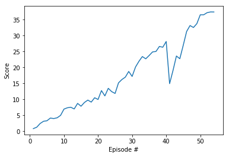

## Report

The goal of this project is to train an agent to solve the Unity Reacher environment. The goal is to teach a double-jointed arm to follow a target location in space for as long as possible.

## Learning algorithm
In this solution the Deep Deterministic Policy Gradient (DDPG) algorithm is used. DDPG is based on the Advantage Actor-Critic (A2C) model. However, the Actor maps the states to actions directly, instead of outputting a probability distribution. DDPG uses 4 neural networks: 
* Deterministic policy network (Local Actor)
* Target policy network (Target Actor)
* Q network (Local Critic)
* Target Q network (Target Critic)

In order to improve stability in DDPG the target networks are stable copies of the local networks which are updated less frequently. 1

## Hyperparameters
The following values were used for the hyperparameters:
* Replay buffer size: 1e6
* Minibatch size: 128
* Discount factor gamma: 0.99
* Soft update of target parameters tau: 1e-3
* Learning rate of the actor: 1e-3
* Learning rate of the critic: 1e-3
* Weight decay: 0

## Neural network architecture
The architecture of the networks consists of 3 fully connected layers, with ReLU activations. The input to the first layer is equal to the state size (33). The hidden layer contains 400, and the output layer 300 units. There is a batch normalisation layer after the first layer.

## Results
The average reward of 30 over the last 100 episodes was achieved after 54 episodes (it is worth noting that the training was interrupted after the 42nd episode, at which point the last saved weights, which were after episode 40, were used as a starting point and the training was restarted). The average score after the 54th episode was 30.24. The figure below shows the plot of the rewards leading to the solution of the environment.

## Future work
This is the simplest solution to this problem, it is plausible that it could achieve better results by implementing a more complex algorithm, such as: PPO, A3C or D4PG.

## References

1 https://towardsdatascience.com/deep-deterministic-policy-gradients-explained-2d94655a9b7b

